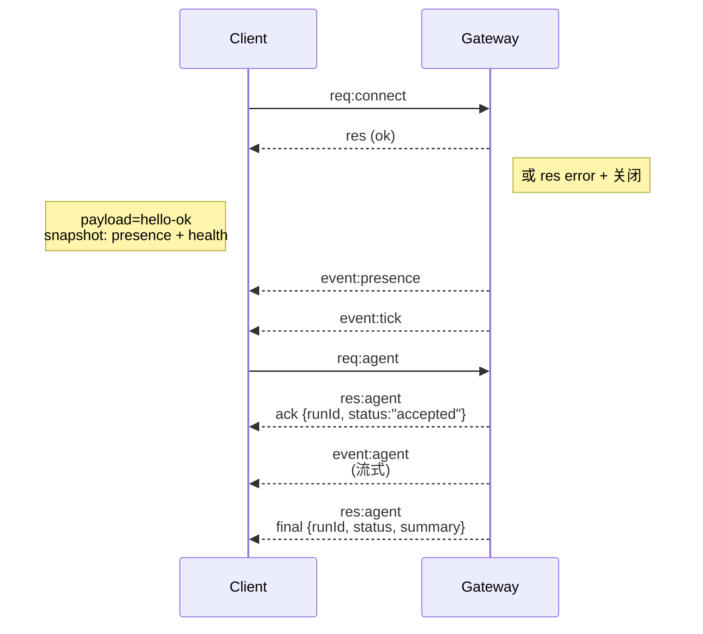

# Gateway 架构

## 概述

- 单一长连接 **Gateway** 拥有所有消息渠道（WhatsApp 通过 Baileys、Telegram 通过 grammY、Slack、Discord、Signal、iMessage、WebChat）。
- 控制平面客户端（macOS 应用、CLI、Web UI、自动化）通过 **WebSocket** 连接至 Gateway，绑定在配置的主机上（默认 `127.0.0.1:18789`）。
- **节点**（macOS/iOS/Android/无头）同样通过 **WebSocket** 连接，但需声明 `role: node` 并附带显式能力/命令。
- 每台主机一个 Gateway；它是唯一打开 WhatsApp 会话的地方。
- **Canvas 宿主** 由 Gateway HTTP 服务提供，路径为：
  - `/__openclaw__/canvas/`（Agent 可编辑的 HTML/CSS/JS）
  - `/__openclaw__/a2ui/`（A2UI 宿主）
    使用与 Gateway 相同的端口（默认 `18789`）。

## 组件与流程

### Gateway（守护进程）

- 维护提供商连接。
- 暴露强类型 WS API（请求、响应、服务端推送事件）。
- 按 JSON Schema 校验入站帧。
- 发出 `agent`、`chat`、`presence`、`health`、`heartbeat`、`cron` 等事件。

### 客户端（mac 应用 / CLI / Web 管理端）

- 每个客户端一个 WS 连接。
- 发送请求（`health`、`status`、`send`、`agent`、`system-presence`）。
- 订阅事件（`tick`、`agent`、`presence`、`shutdown`）。

### 节点（macOS / iOS / Android / 无头）

- 以 `role: node` 连接至**同一 WS 服务器**。
- 在 `connect` 中提供设备身份；配对是**基于设备**的（角色 `node`），审批保存在设备配对存储中。
- 暴露 `canvas.*`、`camera.*`、`screen.record`、`location.get` 等命令。

协议详情：

- [Gateway 协议](/gateway/protocol)

### WebChat

- 使用 Gateway WS API 获取聊天记录和发送消息的静态 UI。
- 在远程部署中，通过与其他客户端相同的 SSH/Tailscale 隧道连接。

## 连接生命周期（单客户端）



## 有线协议（摘要）

- 传输：WebSocket，文本帧携带 JSON 负载。
- 首帧**必须**为 `connect`。
- 握手之后：
  - 请求：`{type:"req", id, method, params}` → `{type:"res", id, ok, payload|error}`
  - 事件：`{type:"event", event, payload, seq?, stateVersion?}`
- 若设置了 `OPENCLAW_GATEWAY_TOKEN`（或 `--token`），`connect.params.auth.token` 必须匹配，否则断开连接。
- 有副作用的调用（`send`、`agent`）需要幂等键以便安全重试；服务端维护短期去重缓存。
- 节点必须在 `connect` 中包含 `role: "node"` 以及能力/命令/权限。

## 配对与本地信任

- 所有 WS 客户端（操作者 + 节点）在 `connect` 时包含**设备身份**。
- 新设备 ID 需要配对审批；Gateway 签发**设备令牌**供后续连接使用。
- **本地**连接（回环或 Gateway 主机自身的 tailnet 地址）可自动批准，以保持同机体验流畅。
- 所有连接必须对 `connect.challenge` 随机数进行签名。
- 签名负载 `v3` 还绑定 `platform` 和 `deviceFamily`；Gateway 在重连时固定已配对元数据，元数据变更需重新配对。
- **非本地**连接仍需要显式审批。
- Gateway 认证（`gateway.auth.*`）对**所有**连接生效，无论本地还是远程。

详情：[Gateway 协议](/gateway/protocol)、[配对](/channels/pairing)、[安全](/gateway/security)。

## 协议类型与代码生成

- 使用 TypeBox 模式定义协议。
- 从这些模式生成 JSON Schema。
- 从 JSON Schema 生成 Swift 模型。

## 远程访问

- 推荐：Tailscale 或 VPN。
- 备选：SSH 隧道

  ```bash
  ssh -N -L 18789:127.0.0.1:18789 user@host
  ```

- 同一握手与认证 token 在隧道上适用。
- 远程部署中可为 WS 启用 TLS 及可选证书固定。

## 运维速览

- 启动：`openclaw gateway`（前台运行，日志输出到 stdout）。
- 健康检查：通过 WS 调用 `health`（也包含在 `hello-ok` 中）。
- 监管：launchd/systemd 实现自动重启。

## 不变约束

- 每台主机上仅有一个 Gateway 控制单个 Baileys 会话。
- 握手是强制的；首帧非 JSON 或非 `connect` 将直接关闭连接。
- 事件不会被重放；客户端必须在出现空缺时自行刷新。
